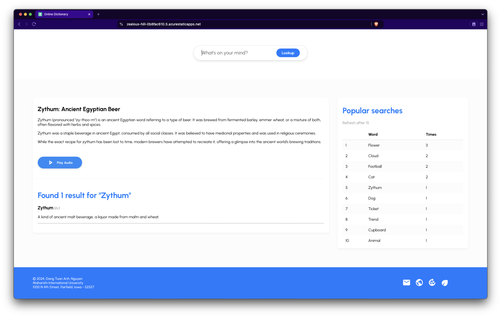

# Online dictionary
Online Dictionary for WAP project

## Demo

Click [Link](https://zealous-hill-0b8fac610.5.azurestaticapps.net/) to see online demo

## Short video to show product overview
[](https://www.youtube.com/watch?v=6tzJNWa9NuE)

## Video explaining verbally the tasks
[](https://www.youtube.com/watch?v=KPW8wjeyIvE)

## Installation

 >>> Run client project

 ```bash
 cd client
 sh start-client.sh
 ```

 >>> Run server project

 ```bash
 cd server
 sh start-server.sh
 ```

## Swagger 
Click this [link](https://wap-1-cgdbeuhhdndge9f9.centralus-01.azurewebsites.net/api-docs/) to see API document

## Project structure
```
.
├── client                      # Client folder
│   ├── src                     # Source code
│   │   ├── components          # Define all component of app
│   │   ├── services            # External service (GeminiAPI)
│   │   ├── App.css             # Custom style for widget
│   │   ├── App.js              # Main app
│   │   ├── ...                 # etc.
│   ├── start-client.sh         # Start client app
│   ├── .env                    # Config environment for app
│   ├── ...                     # etc
├── server                      # Server folder
│   ├── config                  # Config for app (DB)
│   ├── controllers             # App controllers
│   ├── models                  # Models
│   ├── routes                  # Routes
│   ├── swagger                 # API document
│   ├── app.js                  # Main app
│   ├── package.json            # Config for app and hosting
│   ├── start-server.sh         # Start server
│   ├── .env                    # Config enviroment for app
│   ├── ...                     # etc
├── ...                         # etc
└── README.md
```
